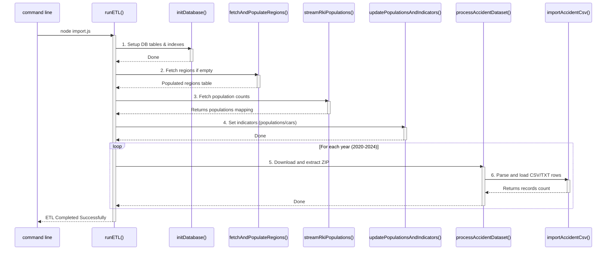

# Developer Walkthrough: How `import.js` Works

This document explains the step-by-step execution flow of the data migration and ETL script ([`import.js`](import.js)). It highlights the sequence of methods from start to finish, helping you explain the process to the examiner.

---

## 1. The Execution Entry Point

When you run `node import.js` from the command line, execution begins at the bottom of the script:

```javascript
if (require.main === module) {
  runETL();
}
```

The `runETL` function orchestrates the entire extraction, transformation, and loading sequence.

---

## 2. Step-by-Step Method Execution Flow

Below is the chronological order of function calls initiated by `runETL`:



---

## 3. Detailed Method Explanations

### Step 1: Database Table Setup
* **Method called**: `initDatabase()` (imported from [`src/config/db.js`](src/config/db.js)).
* **What it does**: Executes `CREATE TABLE` instructions to configure database tables (`regions`, `accidents`, `indicators`, `indicator_values`, `import_runs`, `metadata_sources`) and builds column indexes to speed up dashboards queries.

### Step 2: Fetch and Populate Regions Baseline
* **Method called**: `fetchAndPopulateRegions()`
* **Helper called**: `fetchJson(url)`
* **What it does**: 
  1. Queries the **OpenPLZ API** (`https://openplzapi.org/de/FederalStates`) to retrieve all 16 federal states.
  2. Loops through the states to query their child districts (`/Districts`).
  3. Queries Saxony's municipalities (`/Municipalities?page=X`) to support the Saxony zero-cases reporting requirement.
  4. Inserts all mapped regions into the `regions` table.

### Step 3: Sourcing District Populations
* **Method called**: `streamRkiPopulations()`
* **What it does**: 
  1. Opens an HTTPS stream to the raw RKI CSV repository.
  2. Reads the incoming stream in chunks, parses the text lines to extract the district code (AGS) and population counts, and returns a key-value object (`{ "agsCode": population }`).

### Step 4: Seeding Indicators (Populations and Cars)
* **Method called**: `updatePopulationsAndIndicators(populations)`
* **What it does**: 
  1. Updates the `population` column in the `regions` table for all districts.
  2. Sums up child district populations to determine state-level population figures.
  3. Loops through years `2020-2024` to insert population and passenger car stock counts (`STATE_PKW_STOCK_2023`) into the `indicator_values` table.

### Step 5: Handling ZIP Downloads & Extractions
* **Method called**: `processAccidentDataset(year)`
* **Helpers called**: `downloadFile(url, dest)` and `AdmZip` library.
* **What it does**:
  1. Checks if the target CSV/TXT already exists in the `data/` directory.
  2. If missing, it downloads the zip collection from the OpenGeodata NRW portal.
  3. Extracts the CSV or TXT file using the `AdmZip` utility.
  4. Bypasses Windows file locking issues by copying the extracted file to its target path and then unlinking (deleting) the temporary extraction.
  5. Clears previous event entries for that year to prevent duplicates: `DELETE FROM accidents WHERE year = ?`.
  6. Initiates the parsing and database load by calling `importAccidentCsv(year, csvPath)`.

### Step 6: Parsing and Bulk Importing Accidents
* **Method called**: `importAccidentCsv(year, csvPath)`
* **Helpers called**: `makeAgs8(land, regbez, kreis, gemeinde)` and `cleanCoordinate(val)`.
* **What it does**:
  1. Pre-loads all 834 regions from the database into a memory `Map` to bypass slow SQL lookups during row iterations.
  2. Streams the CSV using the `csv-parser` library.
  3. Cleans coordinates using `cleanCoordinate()` and maps state/district/community columns into a standard 8-digit AGS code using `makeAgs8()`.
  4. Collects rows in batches of 5,000.
  5. Performs bulk inserts inside a SQLite transaction (`BEGIN TRANSACTION` and `COMMIT`), which maximizes database write throughput.
