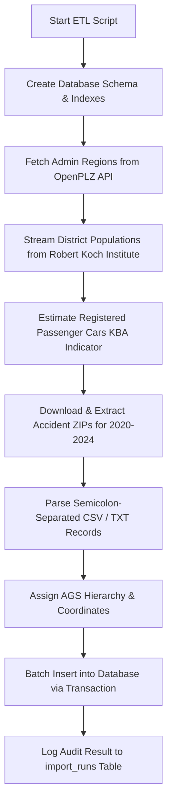

# STRADA-DE Project Documentation

Welcome to the comprehensive technical documentation for **STRADA-DE (Straßenverkehrsunfall-Analyse-Portal Deutschland)**. This document provides complete instructions on how to install and run the application, explains the data migration architectures, details the REST endpoints and OpenAPI/Swagger specifications, and breaks down the modular software engineering design.

---

## 1. How to Run the Application

STRADA-DE is built using a lightweight Node.js/Express backend and a vanilla JavaScript frontend. It requires no heavy external compilation layers.

### Prerequisites
* **Node.js**: Version 16.x or newer is recommended.
* **SQLite3**: The database is powered by a local SQLite engine. The binary compiles automatically via the npm installer.

### Installation
1. Navigate to the project root directory:
   ```bash
   cd "semester project"
   ```
2. Install the necessary dependencies specified in `package.json`:
   ```bash
   npm install
   ```

### Execution Commands

#### A. Running the Web Application
To boot up the Express server and serve the interactive analytics portal:
```bash
node server.js
```
The server will bind to port **3005** and output:
```text
Express STRADA-DE Server running locally at http://localhost:3005
Connected to SQLite database at <project_root>/database.db
```
You can now open your browser and navigate to **`http://localhost:3005/`**.

#### B. Running the Database Validation Script
To run an offline diagnostic audit validating database record counts and answers to the examiner queries:
```bash
node validate.js
```

#### C. Running the ETL Import Script (Optional)
The database file `database.db` is already pre-loaded with **1,270,879** records across 5 years (2020-2024). If you wish to refresh the database from the official sources:
```bash
node import.js
```
*Note: The ETL fetches data from external APIs and streams large files. It may take several minutes to run.*

---

## 2. Data Migration & ETL Pipeline Architecture

The ETL data migration script ([`import.js`](import.js)) performs a fully automated, multi-source migration into our structured SQLite schema. The process is designed to be rate-limit friendly and memory-efficient.



### Step-by-Step Flow

1. **Database Initialization**: Creates tables for `regions`, `accidents`, `indicators`, `indicator_values`, `import_runs`, and `metadata_sources` with high-performance indexes.
2. **Administrative Regions Baseline**:
   * Queries the **OpenPLZ API** (`https://openplzapi.org/`) to fetch names and official administrative codes (AGS - *Amtlicher Gemeindeschlüssel*) for all 16 federal states and 400 districts.
   * Fetches the 418 municipalities for Saxony to establish a comprehensive baseline reference.
3. **Population Sourcing**:
   * Streams the official district-level population CSV directly from the **Robert Koch Institute (RKI)** GitHub repository.
   * Berliner boroughs are aggregated into a single entry representing Berlin Stadt (AGS `11000`).
4. **Registered Passenger Cars Sourcing**:
   * Establishes the official registered passenger car stock (*PKW-Bestand*) for 2023 from the **Kraftfahrt-Bundesamt (KBA)**.
   * State and district values are loaded into the `indicator_values` table for comparative rate calculations.
5. **Accident Records Parsing & Mapping**:
   * Downloads official **Unfallatlas** ZIP files (2020–2024) from OpenGeodata NRW.
   * Extracts the CSV/TXT files and streams them using `csv-parser`.
   * **Performance Trick**: Loads all 834 regions into an in-memory `Map` during parsing. This reduces coordinate/AGS database lookups to an $O(1)$ memory operation, completing processing in seconds instead of minutes.
   * Inserts records in chunks of 5,000 using SQL transactions (`BEGIN TRANSACTION` and `COMMIT`).

---

## 3. REST API Specifications

All endpoints are hosted locally under `/api/*` and return JSON payloads. Endpoints are documented in the [`openapi.json`](openapi.json) file.

### Summary table of Endpoints

| Method | Endpoint | Description | Cache |
| :--- | :--- | :--- | :--- |
| **GET** | `/api/regions` | Retrieve list of regions filtered by level or parent. | Yes (5m) |
| **GET** | `/api/accidents` | Paginated accident events list with filtering. | Yes (5m) |
| **GET** | `/api/aggregates/accidents` | Aggregated accident counts and rates per 100k inhabitants. | Yes (5m) |
| **GET** | `/api/accidents/spatial` | Radial coordinate bounding box search. | Yes (5m) |
| **GET** | `/api/stats` | Unified metrics payload for charts. | Yes (5m) |
| **GET** | `/api/questions` | Pre-computed solutions to examiner questions. | Yes (5m) |
| **GET** | `/api/metadata/sources` | Lists licensing details of all external sources. | No |
| **GET** | `/api/openapi.json` | Serves the OpenAPI 3.0 specification. | No |

---

## 4. End-to-End Technical Implementation Details

STRADA-DE uses a clean separation of concerns, ensuring high code readability and modularity.

```text
semester project/
  ├── package.json
  ├── server.js (Minimal Express router bootstrapper)
  ├── src/
  │    ├── config/
  │    │    └── db.js (SQLite connection pool & migrations)
  │    ├── middleware/
  │    │    └── cache.js (In-memory GET endpoint caching TTL middleware)
  │    ├── services/
  │    │    ├── regionService.js (Regions SQL queries)
  │    │    ├── accidentService.js (Accidents & Spatial queries)
  │    │    └── statsService.js (Aggregations, QA Solvers, and Logs)
  │    └── routes/
  │         ├── regions.js
  │         ├── accidents.js
  │         ├── stats.js
  │         └── questions.js
  └── public/
       ├── index.html (Rebranded light White dashboard template)
       ├── style.css (Vanilla layout tokens, menus, and typography)
       └── js/
             ├── main.js (State controller & tab navigation)
             ├── dashboard.js (KPI cards, YoY bars, doughnuts, and line curves)
             ├── spatial.js (Haversine coordinate radius search and severity charts)
             ├── rankings.js (Level sorting tables and bar charts)
             ├── zeroCases.js (State zero cases reports)
             └── provenance.js (Metadata grids and database logs loader)
```

### Key Technical Patterns

1. **Light White Aesthetic**: Replaced typical neon dark elements with a professional theme (`#f8fafc` white background, `#ffffff` card containers, and slate-grey `#e2e8f0` borders) styled after official German statistical portals.
2. **Graph Legibility**: Chart labels use solid black/deep slate colors (`#0f172a` / `#475569`) and gridlines are drawn in light grey (`#cbd5e1`) to ensure high legibility against the light white background.
3. **In-Memory Cache Middleware**: Intercepts matching GET requests and returns cache hits from an in-memory map. Bypasses requests containing `?cache=false`.
4. **Spatial Haversine Calculation**: Bounding box coordinates are first calculated using lat/lon deltas for quick indexing. The exact distance is then calculated in the service layer using the Haversine formula:
   $$d = 2 R \arcsin\left(\sqrt{\sin^2\left(\frac{\Delta \phi}{2}\right) + \cos(\phi_1) \cos(\phi_2) \sin^2\left(\frac{\Delta \lambda}{2}\right)}\right)$$
5. **Zero-Cases Reconciliation**: Queries the administrative database baseline (`regions` table) filtered dynamically by the selected state code against reported accident events to locate municipalities that recorded zero reported accidents. This baseline comparison ensures municipalities with zero incidents are still correctly audited and listed.
